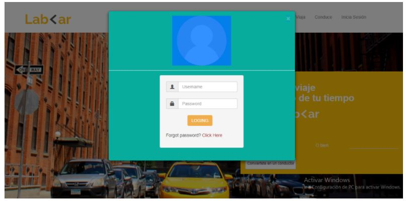
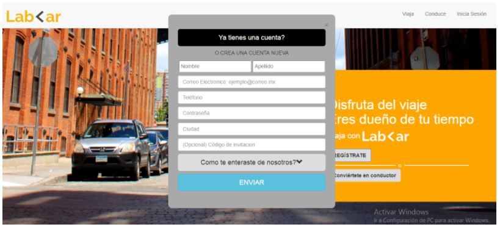
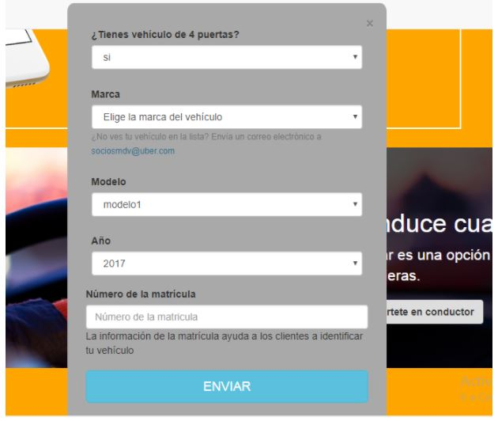

# Labcar - bootstrap

* **Track:** _Common Core_
* **Curso:** _Crea tu propia red social_
* **Unidad:** _No reinventes la rueda_

***
## Objetivo
---
El reto consiste en realizar una página web responsive para desktop y mobile con la ayuda del framework Bootstrap, además de incluir tres ventanas emergentes. La página debe verse así, respectivamente:

Página web - desktop

Página web - mobile

Modal para iniciar sesión

Modal para registrarse

Modal para convertirse en conductor

## Contenido

Este proyecto contiene:

1. Un archivo `index.html` que contiene la estructura inicial de la página web.

2. Una carpeta `assets` donde se encuentra la carpeta `docs` que contiene la imagen en formato ***png*** de la página web a replicar en sus versiones desktop y mobile, además de las ventanas emergentes en formato ***jpg***.

3. Una carpeta `css` que contiene un archivo `main.css` donde hay clases reutilizables y específicas para darle estilo a la página web.

4. Una carpeta `vendors` que contiene una carpeta llamada `bootstrap`, la que a su vez incluye tres carpetas: `css` con la hoja de estilos propia del framework, `fonts` y `js`.

5. Un archivo  **`README.md`** que explica el contenido del repositorio.

## Autora
Lizbeth Félix Peña

## Fecha
17/12/2017
